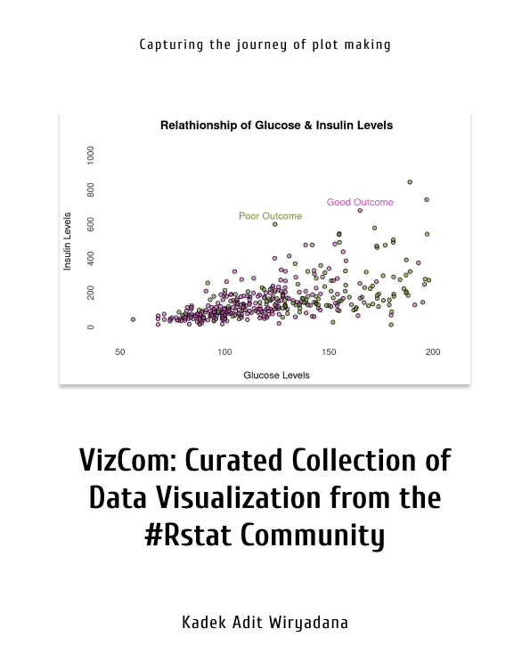

--- 
title: "VizCom - Curated Collection of Data Visualization from the #Rstat Community"
author: "Kadek Adit Wiryadana & Rstat Community"
date: "2022-04-03"
site: bookdown::bookdown_site
documentclass: book
bibliography: [book.bib, packages.bib, other_packages.bib, other.bib]
url: https://wiryadana.github.io/VizCom/
# cover-image: path to the social sharing image like images/cover.jpg
description: |
  This is an album of data collection created by Rstat community published in various web and social media.
biblio-style: apalike
csl: chicago-fullnote-bibliography.csl
---

#  {-}

## Welcome {-}
I always dreamed to be a book writer since I was kid. Thanks to the opportunity given by the boom of open source software, finally I am able to compose my first book while being a self sufficient publisher at once. I was trained as a medical doctor. During my training, I was exposed to epidemiology and statistics. Statistics turned out to be one of my favorite subject. When first taught, we were told to use a proprietary software. It was a point of click software, relatively straight forward and all works well for the kind of analysis we usually need. Only after I need to learn to do a more complex analysis and a better looking graph, the software could not provide the neccesarry feature. Fast forwards, I learn that there are a programming language, called R, that was free and customizable but has a steep learning curve. I tried. Still, for almost three years, I'm still cheating from stack overflow and others for the works that I do with R. 

There are various books about the science and conceptual framework of data visualization to the technical detail of R code to the manual book of each function. What lacking is a curation of community made plot. There are numerous individual sharing their creativity with R in the Twitter and blog. I believe for noobs like me, studying their plot is a good way to learn plot making with R. Community made plot were full of creativity, while tutorial available in books were rather basic. In the end, this books is basically my personal notes on learning plot making with R and all others packages.

I hope somebody will read this books someday. This books should be available for free in digital format, both the web and pdf version. his book were made with R v4.1.2 through RStudio Server running on top of Ubuntu Server (v21.04).[@R-base; @rstudio_2021; @ubuntu_2021] The book were possible only because somebody skillful and clever invented bookdown, rmarkdown, knitr and tidyverse.[@R-bookdown;@R-rmarkdown;@R-knitr;@R-tidyverse] For the sake of accesibility, I provided the qrcode which code for the URL of the books for the readers to scan.[@qrcode2021] If you have suggestions, feel free to contact me at ka.wiryadana@gmail.com or wiryadana@wiryadana.org. This book were written during my free time after I had to have surgery for a non-united fracture of right arm. This is a one effort to avoid over thinking and a way to recover from my sadness. Please do not expect a perfection.

Eventhough I work alone, the content were inspired and cited from various #Rstat Community, thus a big thanks for them. Also, I would like to thank my mother who always take care of me, my father and big brother who always supportive, and my little brother who forces me for a play when I hit a block. The last for someone who I love, a perfect woman who I don't expect to meet, I hope the best for you even though you do not felt the same.

 

